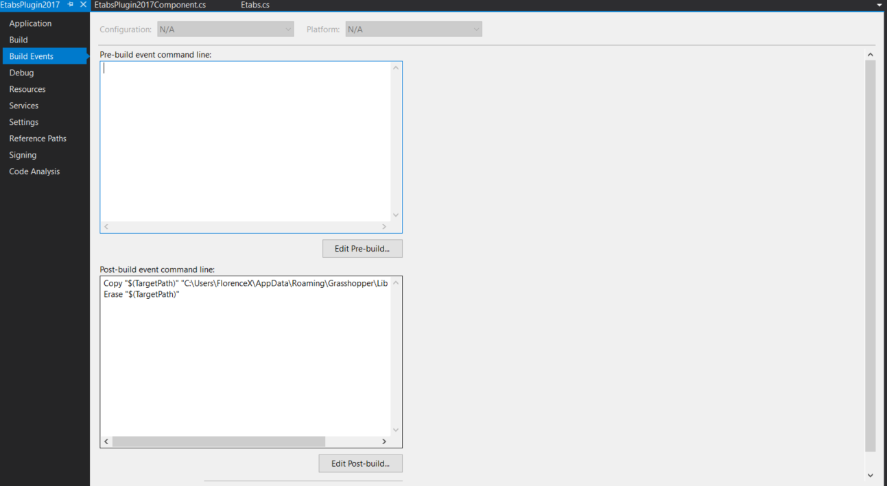

# Grasshopper and Etabs
## Background
   How to make Grasshopper talk to etabs?

## Result

## Workflow

1. Save Grid Info of the building in an Excel File ([Grid Info](Grasshopper))
2. Draw a Rhino by using Grasshopper ([Sample Model](Grasshopper))
3. Save model information in Excel file, which is generated by the grasshopper file([aa](Grasshopper))
4. Use this component in Grasshopper to build a model in Etabs which is based on Etabs API

## Prerequisites
* Grasshopper
   * Install Python package (xlrd) to read Excel file ([xlrd.PyPI](https://pypi.org/project/xlrd/#files))
   ~~~~
   pip install xlrd-1.2.0-py2.py3-none-any.whl
   ~~~~
   * Install Python package (xlsxwriter) to write to Excel file ([xlsxwriter.PyPI](https://pypi.org/project/XlsxWriter/))
   ~~~~
   pip install XlsxWriter-1.3.2-py2.py3-none-any.whl
   ~~~~ 
   * Install Python package to Grasshopper ([reference](https://www.grasshopper3d.com/forum/topics/excel-gh-python?page=1&commentId=2985220%3AComment%3A958282&x=1#2985220Comment958282))
     1. In Rhino type EditPythonScript
     2. In this Python editor go Tools -> Options -> Files. Then you will see an overview of current paths used
     3. Move the folders xlrd and xlsxwriter to one of the directories.
  
   
* Visaul Studio 2017
   * Use the Grasshopper Add-on for v6(c#) template and make sure load the references correctly

   * Customize directory of a post-build grasshopper gha file (recommend to copy the build file to Grasshopper Library folder)

   * Add the following Etabs and Excel API (recommend to copy the Etabs dll file to the same folder of solution file)

## Reference
   * [C# Scripting and Plugin Development for Grasshopper](https://www.youtube.com/channel/UCUJgViAduAoRsf89ZtyF8dQ) (highly recommend to go through this tutorial especially Part 3 and Part 4 for Grasshopper setting in Visual Studio)
   * [ETABS API - Advanced Modelling Tutorial (Parametric Design)](https://www.youtube.com/watch?v=wArOhT8czc4)
   
      
